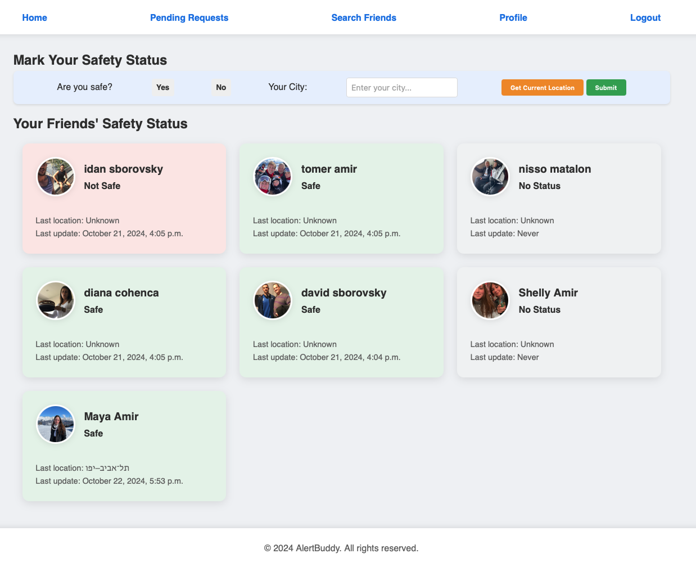

# AlertBuddy

A real-time safety alert web application that lets users send and receive location-based alerts to their network. Built with Django and deployed on Vercel.



---

## Features

- Send and receive real-time safety alerts to friends and contacts
- User profiles with friend requests and connections
- Location-aware alerts with map integration
- Mobile-friendly responsive UI

## Tech Stack

| Layer | Technology |
|-------|-----------|
| Backend | Django 5.1, Python 3 |
| Database | SQLite (dev) |
| Deployment | Vercel |
| Auth | Django built-in auth |

## Run Locally

```bash
git clone https://github.com/Yoavsb25/AlertBuddy.git
cd AlertBuddy
pip install -r requirements.txt
python manage.py migrate
python manage.py runserver
```

Open http://localhost:8000
